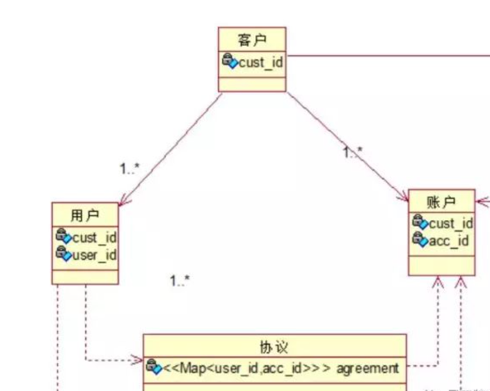
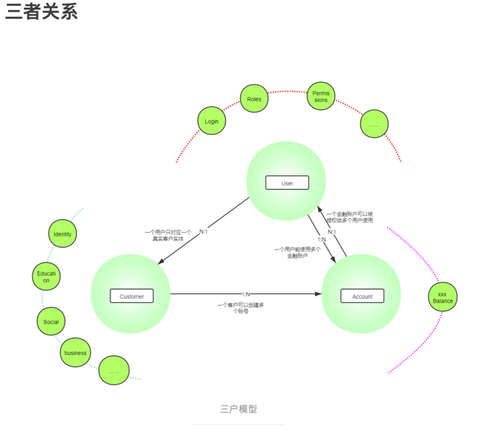
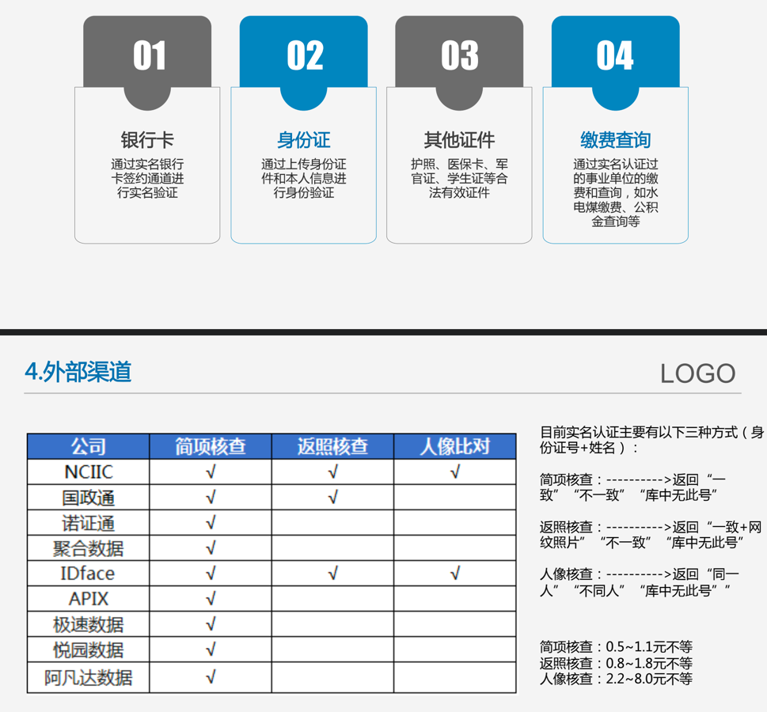
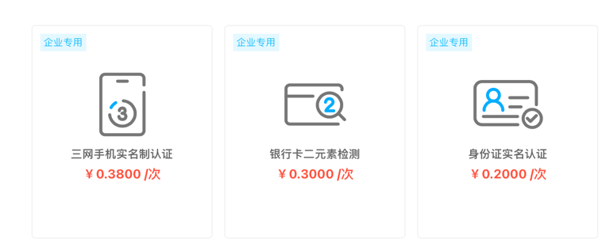

# user-center
用户中心也叫会员系统、客户系统

#参考文章：

微信公众号(作者：凤凰牌老熊) ：https://mp.weixin.qq.com/s/SQ_Xyat0EnsA166Nxmz5WQ

简书文章地址(作者：Owen_Lau2)：https://www.jianshu.com/p/3d5004b25a1e

##用户中心设计原则之三户模型
三户模型最早是在增强型电信运营图（Enhanced Telecom Operations Map，eTOM）中提出，在电信行业中得到广泛使用。 三户指客户（Customer）、用户（User）和账户(Account)。

###客户、用户、账户基本概念

客户：指现实生活中一个自然人或者法人,仅体现其社会身份,不具备操作能力

用户：客户使用产品时的实体,具有实际操作能力

账户：客户存放资金时候的实体,因为用户具有操作能力，所以只有用户可以操作账户

这三个是相互关联的实体，这种关联只是一个归属和映射的关系，而三个实体本身是相互独立的，分别是体现完全不同的几个域的信息，客户是体现了社会域的信息，用户体现了业务域的信息，账户体现的是资金域的信息。

####三者关系

账户归属于客户，用户是账户操作实体，用户通过操作授权获得账户操作权限.

同个人客户一样，企业客户在银行或支付平台开设资金账户，资金账户归属于此客户。企业客户是一个组织，其账户必然是组织授权组只内有人去操作，但是这个操作人，同个人客户一样，只是系统的使用者，即：用户。

企业的资金比较大，并且有严格的业务流程，所以在系统使用上，肯定是多个用户操作一个或多个资金账户。这种关系本身来说，也是一种授权关系，企业授权相应的用户来操作特定的资金账户，只不过为了管理方便，可以引入**_角色管理机制（RBAC模型）_**来实现。

以下是两张图可以参考一下

## 三户模型之数据模型

###用户数据模型（User）

用户信息模型
登录信息：登录账号、密码、安全问题、绑定邮箱、绑定手机号等等；
角色信息：角色名称、角色编号、对应的权限编号等等；
权限信息：权限编号、权限名称、权限类型等等；

###客户数据模型（Customer）包含个人与企业

####1、个人身份信息模型
基本信息：姓名、性别、职业、年龄、当前住址、邮箱、联系电话、联系手机号、婚姻状况

证件信息：证件类型、证件号码、有效期、证件登记地址

教育信息：学历、学历教育起止时间、专业、学历院校

管理信息：是否为本集团员工、客户的评级、客户等级、风险等级、是否黑名单、锁定状态、用户状态

标签信息：一个客户有多个标签，需提前对标签做好规划

协议管理：客户对应等级的协议编号、协议版本号、协议内容url地址

####2、企业身份信息模型
基本信息：公司名称、公司简称、注册地址、营业执照编号、营业执照副本照片

法人信息：法人姓名、法人证件类型、法人证件号码、法人身份证正面照片、法人身份证反面照片

企业联系信息：联系地址-省、联系地址-市/区、联系地址-县/乡镇、联系地址-街道/门号

管理信息：是否为本集团企业、企业等级、企业风险等级、是否黑名单、锁定状态、用户状态

标签信息：一个客户有多个标签，需提前对标签做好规划

协议管理：客户对应等级的协议编号、协议版本号、协议内容url地址

###3、个人与企业业务边界
个人与企业是隔离的,一个用户既可以是单独的个人永不也可以是企业用户，但是用户信息、登录入口等相关信息也应该是不同的

#账户归并如何做?
同一个证件视为同一个客户,再进行用户归并的时候，用户证件+手机号也需要进行三要素验证,验证结束后才能
进行账号归并.

###账户数据模型（Account）

Account_Template 模型
主键：Account_Template_Code
基本关联信息：账户模板名称、Type（个人、企业、内部账户）、币种、国家、机构...
控制信息：是否允许充值、是否允许提现、是否允许余额为负、是否允许支付、是否允许转账进入、是否允许转账转出

# 实名相关
目前监管趋向严格，注册用户一般都会要求进行实名认证,认证渠道和认证类型主要是以下

认证配置相关一般与渠道支付路由做在一起为认证路由，包含认证渠道、认证要素、认证费用

以聚合数据官方网站数据为例，二要素、三要素验证费用如下

# 用户中心技术点

1、读多写少，使用缓存优化

2、客户分库分表，可以针对客户类型进行数据库切分,提升系统效率

